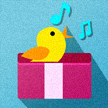

# &nbsp; [Box of Birds](http://alexa.amazon.com/#skills/amzn1.echo-sdk-ams.app.c4b42dc3-8a42-4136-b8c9-5d4874d9fbe2)
 4

To use the Box of Birds skill, try saying...

* *Alexa, open the Box of Birds*

* *Alexa, launch the Box of Birds*

* *Alexa, ask the Box of Birds for help*

This box houses hundreds of birds, including an occasional surprise.  Just say, "Alexa, open the Box of Birds" and your Echo will play a random bird song or call for you.  

Want to know the name of the bird you just heard?  Check out the Home Tab in your Alexa app.  And, please visit...

www.birdsongskill.com

...to see who recorded these birds and discover what other birds can be found inside your Echo.

This is the companion skill to the more complete Bird Song Skill found at...

http://alexa.amazon.com/spa/index.html#skills/amzn1.echo-sdk-ams.app.f7cc0ab6-6496-4e31-be2b-93b4926db937

***

### Skill Details

* **Invocation Name:** the box of birds
* **Category:** null
* **ID:** amzn1.echo-sdk-ams.app.c4b42dc3-8a42-4136-b8c9-5d4874d9fbe2
* **ASIN:** B01HX2Z1H4
* **Author:** Thomptronics
* **Release Date:** July 4, 2016 @ 07:57:40
* **In-App Purchasing:** No
