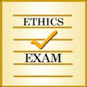

# &nbsp; [Ethics Exam](http://alexa.amazon.com/#skills/amzn1.echo-sdk-ams.app.a6467907-34df-45b0-a8b3-0ee638beabec)
 0

To use the Ethics Exam skill, try saying...

* *Alexa, open ethics exam*

* *Alexa, tell ethics exam to say the main content*

* *Alexa, ask ethics exam for some tips*

The Ethics Exam skill provides you with a review of important ethical guidelines in the Code of Ethics, including how to handle dual relationships, professional misrepresentation, informed consent, malpractice, private conduct, fees, and HIPAA.

***

### Skill Details

* **Invocation Name:** ethics exam
* **Category:** null
* **ID:** amzn1.echo-sdk-ams.app.a6467907-34df-45b0-a8b3-0ee638beabec
* **ASIN:** B01I22CL1S
* **Author:** Licensure Exams, Inc.
* **Release Date:** July 13, 2016 @ 07:27:32
* **In-App Purchasing:** No
