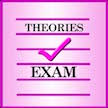

# &nbsp; [Theories Exam](http://alexa.amazon.com/#skills/amzn1.echo-sdk-ams.app.34563e20-d860-4cd6-8def-330479a645e0)
 0

To use the Theories Exam skill, try saying...

* *Alexa, open theories exam*

* *Alexa, tell theories exam to get me information about transactional analysis*

* *Alexa, ask theories exam for adlerian*

The Theories Exam skill provides a review of the major theories used in psychotherapy including Gestalt, Adlerian, cognitive-behavioral, person-centered, narrative, solution-focused, existential, transactional analysis, psychodynamic, and more.

***

### Skill Details

* **Invocation Name:** theories exam
* **Category:** null
* **ID:** amzn1.echo-sdk-ams.app.34563e20-d860-4cd6-8def-330479a645e0
* **ASIN:** B01I22CS1Q
* **Author:** Licensure Exams, Inc.
* **Release Date:** July 12, 2016 @ 07:27:39
* **In-App Purchasing:** No
