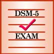

# &nbsp; [DSM5 Exam](http://alexa.amazon.com/#skills/amzn1.echo-sdk-ams.app.cdfb12c2-9d97-4466-9f31-dcb03d48dc60)
 0

To use the DSM5 Exam skill, try saying...

* *Alexa, open dsm five exam*

* *Alexa, tell dsm five exam to talk to me about Schizophrenia*

* *Alexa, tell dsm five exam to talk to me about autism*

The DSM-5 Exam skill provides you with a review of all of the disorders in the DSM-5, including diagnostic features, prevalence, disorder development, and risk factors associated with certain disorders. Assessment and treatment recommendations are also discussed.

***

### Skill Details

* **Invocation Name:** d. s. m. five exam
* **Category:** null
* **ID:** amzn1.echo-sdk-ams.app.cdfb12c2-9d97-4466-9f31-dcb03d48dc60
* **ASIN:** B01I22E5VC
* **Author:** Licensure Exams, Inc.
* **Release Date:** July 12, 2016 @ 08:27:41
* **In-App Purchasing:** No
