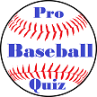

# &nbsp; [Pro Baseball Quiz](http://alexa.amazon.com/#skills/amzn1.echo-sdk-ams.app.be28e6e0-7ae2-4736-97aa-8ba955605a02)
 0

To use the Pro Baseball Quiz skill, try saying...

* *Alexa, open Pro Baseball Quiz.*

* *Repeat the question.*

* *My answer is one.*

You'll need to know your baseball stats to do well on this quiz! It focuses on both single season and career leaders. There are questions for all levels of baseball fans. Just say, "Alexa, open Pro Baseball Quiz" to get started. You will be asked five questions, then presented with four numbered answer choices. You can answer by saying "one," "two," "three," or "four" to select your answer choice. You can also say, "Repeat the question" if you did not hear it the first time.

***

### Skill Details

* **Invocation Name:** pro baseball quiz
* **Category:** null
* **ID:** amzn1.echo-sdk-ams.app.be28e6e0-7ae2-4736-97aa-8ba955605a02
* **ASIN:** B01I6CHT1G
* **Author:** Christopher Roemer
* **Release Date:** July 11, 2016 @ 04:57:35
* **In-App Purchasing:** No
