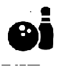

# &nbsp; [Bowling Facts](http://alexa.amazon.com/#skills/amzn1.echo-sdk-ams.app.df361222-5b9d-4ae4-b2ab-14d9c933bbcb)
 1

To use the Bowling Facts skill, try saying...

* *Alexa ask bowling fact to tell me a fact*

* *Alexa, ask bowling fact to tell me a bowling fact*

* *Alexa, ask bowling fact to tell me trivia*

Bowling Facts from the past and present time

***

### Skill Details

* **Invocation Name:** bowling fact
* **Category:** null
* **ID:** amzn1.echo-sdk-ams.app.df361222-5b9d-4ae4-b2ab-14d9c933bbcb
* **ASIN:** B01I7AEVVS
* **Author:** Brian Hager
* **Release Date:** July 20, 2016 @ 09:27:27
* **In-App Purchasing:** No
