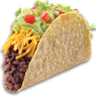

# &nbsp; [Taco Facts](http://alexa.amazon.com/#skills/amzn1.echo-sdk-ams.app.0a347787-81c0-4aa6-ad0d-4955c736dc4d)
 5

To use the Taco Facts skill, try saying...

* *Alexa ask taco facts to give me a taco fact.*

* *Alexa ask taco facts to tell me a taco fact.*

* *Alexa ask taco facts to give me some taco information.*

This Alexa App provides fun facts about tacos simply by asking, "Alexa, ask taco facts to tell me a taco fact". There are no prerequisites or account requirements. It does not collect any taco related information from the user.

***

### Skill Details

* **Invocation Name:** taco facts
* **Category:** null
* **ID:** amzn1.echo-sdk-ams.app.0a347787-81c0-4aa6-ad0d-4955c736dc4d
* **ASIN:** B01I7GU24M
* **Author:** Jason Sit
* **Release Date:** July 13, 2016 @ 02:57:34
* **In-App Purchasing:** No
