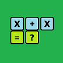

# &nbsp; [Addition Flash Cards](http://alexa.amazon.com/#skills/amzn1.echo-sdk-ams.app.72261f61-58d9-4d48-8ccf-f3d2681990cb)
 0

To use the Addition Flash Cards skill, try saying...

* *Alexa start Addition Flash Cards*

* *The answer is 4*

* *I don't know*

Addition Flash Cards - lets you interactively test your basic addition skills with randomly chosen numbers between 0 and 100.

***

### Skill Details

* **Invocation Name:** addition flash cards
* **Category:** null
* **ID:** amzn1.echo-sdk-ams.app.72261f61-58d9-4d48-8ccf-f3d2681990cb
* **ASIN:** B01I7RUD3G
* **Author:** Carrington Enterprises
* **Release Date:** July 11, 2016 @ 09:27:36
* **In-App Purchasing:** No
