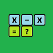

# &nbsp; [Subtraction Flash Cards](http://alexa.amazon.com/#skills/amzn1.echo-sdk-ams.app.824565d0-ce26-4a1c-bfb9-a624738b6fc0)
 0

To use the Subtraction Flash Cards skill, try saying...

* *Alexa start Subtraction Flash Cards*

* *The answer is 4*

* *I don't know*

Subtraction Flash Cards - lets you interactively test your basic subtraction skills with randomly chosen numbers between 0 and 100.

***

### Skill Details

* **Invocation Name:** subtraction flash cards
* **Category:** null
* **ID:** amzn1.echo-sdk-ams.app.824565d0-ce26-4a1c-bfb9-a624738b6fc0
* **ASIN:** B01I8DYYQQ
* **Author:** Carrington Enterprises
* **Release Date:** July 12, 2016 @ 04:27:39
* **In-App Purchasing:** No
