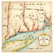

# &nbsp; [Farmington History Facts](http://alexa.amazon.com/#skills/amzn1.echo-sdk-ams.app.a88ce90e-c18f-498a-ab0f-b0e0b9ba7dfa)
 0

To use the Farmington History Facts skill, try saying...

* *Alexa open farmington history*

* *Alexa, ask farmington history to tell me a fact*

* *Alexa, ask farmington history to give me a history fact*

This skill has very interesting and amusing facts about the history of Farmington. Once you say the invocation name to Alexa, then all you have to do is ask her to tell you a fact. Then only will it give you an unique fact.

***

### Skill Details

* **Invocation Name:** farmington history
* **Category:** null
* **ID:** amzn1.echo-sdk-ams.app.a88ce90e-c18f-498a-ab0f-b0e0b9ba7dfa
* **ASIN:** B01I8PM4A2
* **Author:** Sanmati Choudhary
* **Release Date:** July 14, 2016 @ 07:27:27
* **In-App Purchasing:** No
