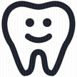

# &nbsp; [Dr Dentistry](http://alexa.amazon.com/#skills/amzn1.echo-sdk-ams.app.246df867-06d7-492b-9157-decefb1b083f)
 0

To use the Dr Dentistry skill, try saying...

* *Alexa, ask doctor dentistry to tell me a dentistry fact*

* *Alexa, ask doctor dentistry to give me a dentistry fact*

* *Alexa, ask doctor dentistry for a tooth fact*

This is meant for the general populations. This could be useful for children, students, pre-dental students, and even dentistry students!  This Alexa skill app is great for learning about the teeth.

Start by asking for an dentistry fact.

***

### Skill Details

* **Invocation Name:** doctor dentistry
* **Category:** null
* **ID:** amzn1.echo-sdk-ams.app.246df867-06d7-492b-9157-decefb1b083f
* **ASIN:** B01I8SLMI4
* **Author:** RedCoke
* **Release Date:** July 14, 2016 @ 02:27:26
* **In-App Purchasing:** No
