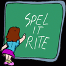

# &nbsp; [Spell it Right](http://alexa.amazon.com/#skills/amzn1.echo-sdk-ams.app.e5b58930-5a52-4095-9ef1-b592451ecf45)
 1

To use the Spell it Right skill, try saying...

* *Alexa ask spelling master to select level beginner*

* *definition please*

* *part of speech*

Spell it Right is an interactive game where Alexa will say you a word and you need to spell it right in order to score points.First you must select a level to get started with the game. If you are unaware of the word you can ask Alexa for the definition of the word and part of speech as well (like Spelling Bee ;-) ).

Sample Utterances:

Alexa ask spelling master to select level beginner

Alexa ask spelling master for definition please

Alexa ask spelling master for part of speech please

Alexa correct spelling is .....

***

### Skill Details

* **Invocation Name:** spelling master
* **Category:** null
* **ID:** amzn1.echo-sdk-ams.app.e5b58930-5a52-4095-9ef1-b592451ecf45
* **ASIN:** B01IB1HB6U
* **Author:** Balaji
* **Release Date:** August 5, 2016 @ 03:37:44
* **In-App Purchasing:** No
