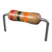

# &nbsp; [Resistor Value](http://alexa.amazon.com/#skills/amzn1.echo-sdk-ams.app.00a362ea-b4c4-4d85-95b9-2e0c7c5283c9)
 0

To use the Resistor Value skill, try saying...

* *Alexa, open resistor value*

* *the colors are, red black orange*

* *Alexa, ask resistor value colors, green blue red*

The Resistor Value skill will prompt you for the 3 colors on your resistor and 
respond with the resistance value they represent. 

Just say "Alexa, open Resistor Value" and she will respond with 
"What are the colors of the 3 bands?".  
Speak the 3 colors and she will tell you the resistance value.

No special hardware or permissions are required.

***

### Skill Details

* **Invocation Name:** resistor value
* **Category:** null
* **ID:** amzn1.echo-sdk-ams.app.00a362ea-b4c4-4d85-95b9-2e0c7c5283c9
* **ASIN:** B01ICNP4PC
* **Author:** EMKlaus
* **Release Date:** July 19, 2016 @ 01:57:50
* **In-App Purchasing:** No
