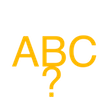

# &nbsp; [Alphabet flash cards](http://alexa.amazon.com/#skills/amzn1.echo-sdk-ams.app.ecd05972-4a8f-4542-acc7-d8df6d8f7743)
 1

To use the Alphabet flash cards skill, try saying...

* *Alexa, open alphabet flash cards*

* *the answer is a.*

* *my answer is c.*

Helps kids learn about the alphabet letters and how to spell words.

***

### Skill Details

* **Invocation Name:** alphabet flash cards
* **Category:** null
* **ID:** amzn1.echo-sdk-ams.app.ecd05972-4a8f-4542-acc7-d8df6d8f7743
* **ASIN:** B01ICRTDJ6
* **Author:** -
* **Release Date:** July 19, 2016 @ 06:27:42
* **In-App Purchasing:** No
