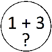

# &nbsp; [SimpleAddition](http://alexa.amazon.com/#skills/amzn1.echo-sdk-ams.app.5c5b4757-e383-44db-811a-3f3afacf469a)
 0

To use the SimpleAddition skill, try saying...

* *Alexa, open simple addition.*

* *the answer is 5.*

* *my answer is 5.*

This helps kids develop number and addition skills by asking what the sum of two numbers are. It only uses the numbers 1 through 5 to make it suited for beginners of addition.

***

### Skill Details

* **Invocation Name:** simple addition
* **Category:** null
* **ID:** amzn1.echo-sdk-ams.app.5c5b4757-e383-44db-811a-3f3afacf469a
* **ASIN:** B01ICSCR5M
* **Author:** -
* **Release Date:** July 14, 2016 @ 01:57:33
* **In-App Purchasing:** No
