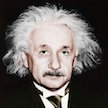

# &nbsp; [Albert Einstein](http://alexa.amazon.com/#skills/amzn1.echo-sdk-ams.app.313d3728-16e0-446e-b5fc-eda6102d3f98)
 1

To use the Albert Einstein skill, try saying...

* *Alexa, ask Albert Einstein for a quote*

* *Alexa, ask Albert Einstein to tell me something smart*

* *Alexa, ask Albert Einstein to enlighten me*

Extensive database of quotes by Albert Einstein, one of the smartest and wittiest people ever being alive.

Just ask Albert to give you one of this famous quotes or tell you something smart about how this world is built.

***

### Skill Details

* **Invocation Name:** albert einstein
* **Category:** null
* **ID:** amzn1.echo-sdk-ams.app.313d3728-16e0-446e-b5fc-eda6102d3f98
* **ASIN:** B01IE3ESES
* **Author:** FINIK LABS LLC
* **Release Date:** July 20, 2016 @ 02:28:09
* **In-App Purchasing:** No
