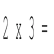

# &nbsp; [Algebra Flash Cards](http://alexa.amazon.com/#skills/amzn1.echo-sdk-ams.app.9d0e2a8a-6b89-43d3-a1de-0ba966e066da)
 0

To use the Algebra Flash Cards skill, try saying...

* *Alexa, launch algebra flash cards*

* *my answer is 12*

* *my answer is 20*

Algebra Multiplication Falsh Cards for kids.

***

### Skill Details

* **Invocation Name:** algebra flash cards
* **Category:** null
* **ID:** amzn1.echo-sdk-ams.app.9d0e2a8a-6b89-43d3-a1de-0ba966e066da
* **ASIN:** B01IEKIXOC
* **Author:** Ashish Singh
* **Release Date:** July 20, 2016 @ 08:27:33
* **In-App Purchasing:** No
