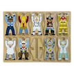

# &nbsp; [Guess the Occupation](http://alexa.amazon.com/#skills/amzn1.echo-sdk-ams.app.0fd47543-6b17-426d-b688-5729fcc7df25)
 0

To use the Guess the Occupation skill, try saying...

* *Alexa, open guess the occupation*

* *Alexa, launch guess the occupation*

* *Alexa, start guess the occupation*

This flash card game teaches the children age 13+ about community workers. it ask 5 questions about different occupations and you have to guess the right occupation

***

### Skill Details

* **Invocation Name:** guess the occupation
* **Category:** null
* **ID:** amzn1.echo-sdk-ams.app.0fd47543-6b17-426d-b688-5729fcc7df25
* **ASIN:** B01IEOU2BK
* **Author:** Sakshum
* **Release Date:** July 19, 2016 @ 05:27:59
* **In-App Purchasing:** No
