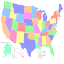

# &nbsp; [State Flash Cards](http://alexa.amazon.com/#skills/amzn1.echo-sdk-ams.app.f7c127b1-7f79-41b8-a17b-1c6eeb7c2960)
 0

To use the State Flash Cards skill, try saying...

* *Alexa Open State Flash Cards*

* *Yes*

* *California*

This skill helps you study the state codes for the states of the United States of America. You'll be given a state code and you're asked to name the state.

The app is meant to be a tiny bit educational but try to have some fun as well!

***

### Skill Details

* **Invocation Name:** state flash cards
* **Category:** null
* **ID:** amzn1.echo-sdk-ams.app.f7c127b1-7f79-41b8-a17b-1c6eeb7c2960
* **ASIN:** B01IG25A4Y
* **Author:** S. M. Unlisted
* **Release Date:** July 15, 2016 @ 05:27:36
* **In-App Purchasing:** No
