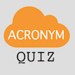

# &nbsp; [Cloud Acronym Quiz](http://alexa.amazon.com/#skills/amzn1.echo-sdk-ams.app.b16ec8dc-e9aa-4909-8786-2c87cc3542db)
 0

To use the Cloud Acronym Quiz skill, try saying...

* *Alexa, play Cloud Acronym Quiz*

* *Alexa, start playing Cloud Acronym Quiz*

* *Alexa, begin Cloud Acronym Quiz*

Amazon Web Services uses acronyms frequently; this interactive quiz tests your knowledge with dozens of questions. Learn the lingo, and "EC2 ASG in a VPC" will finally make sense!
NOTE: as "Amazon" is a protected word, so be sure to say "the answer is..." beforehand.

***

### Skill Details

* **Invocation Name:** cloud acronym quiz
* **Category:** null
* **ID:** amzn1.echo-sdk-ams.app.b16ec8dc-e9aa-4909-8786-2c87cc3542db
* **ASIN:** B01IGF9YHU
* **Author:** woodlandh
* **Release Date:** July 18, 2016 @ 05:57:29
* **In-App Purchasing:** No
