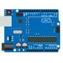

# &nbsp; [Dweeno Quiz](http://alexa.amazon.com/#skills/amzn1.echo-sdk-ams.app.f7911ea3-8643-498c-8203-66378b563121)
 0

To use the Dweeno Quiz skill, try saying...

* *Alexa, start dweeno quiz*

* *the answer is blink*

* *a sketch*

Dweeno Quiz is a question and answer game to test your knowledge of the Arduino open-source platform. 
Just say "Alexa, Start Dweeno Quiz" and she will prompt you through the game.

***

### Skill Details

* **Invocation Name:** dweeno quiz
* **Category:** null
* **ID:** amzn1.echo-sdk-ams.app.f7911ea3-8643-498c-8203-66378b563121
* **ASIN:** B01IGGVT9U
* **Author:** EMKlaus
* **Release Date:** July 18, 2016 @ 11:27:28
* **In-App Purchasing:** No
