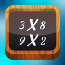

# &nbsp; [Multiplication Table Tester](http://alexa.amazon.com/#skills/amzn1.echo-sdk-ams.app.ed914117-c332-4b6f-ba02-7b6c04780d95)
 0

To use the Multiplication Table Tester skill, try saying...

* *Alexa, ask Multiplication Table Tester to start a new game*

* *Alexa, ask Multiplication Table Tester to start*

* *The answer is 50*

A flash card game for learning the basic multiplication table.

You will be asked 5 basic multiplication questions.  This is a simple game where you get a point for each question that you answer correctly.  Try to answer as many questions correctly as you can.

***

### Skill Details

* **Invocation Name:** multiplication table tester
* **Category:** null
* **ID:** amzn1.echo-sdk-ams.app.ed914117-c332-4b6f-ba02-7b6c04780d95
* **ASIN:** B01IJMKSXY
* **Author:** Mike Commendatore
* **Release Date:** July 19, 2016 @ 04:27:32
* **In-App Purchasing:** No
