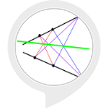

# &nbsp; [Achieve More](http://alexa.amazon.com/#skills/amzn1.echo-sdk-ams.app.d68f613d-3bb9-4001-9bc5-92d5c3c7d04a)
 0

To use the Achieve More skill, try saying...

* *Alexa, open Achieve More*

* *Score card*

* *Start test*

Assess your kindergarten child...or kindergarten self!

***

### Skill Details

* **Invocation Name:** achieve more
* **Category:** null
* **ID:** amzn1.echo-sdk-ams.app.d68f613d-3bb9-4001-9bc5-92d5c3c7d04a
* **ASIN:** B01IOUIMHK
* **Author:** LP
* **Release Date:** July 21, 2016 @ 07:58:45
* **In-App Purchasing:** No
