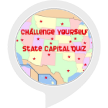

# &nbsp; [state capitals](http://alexa.amazon.com/#skills/amzn1.ask.skill.8d3eb303-928b-4a5c-8707-c1dc47003631)
 0

To use the state capitals skill, try saying...

* *Alexa, ask State Capitals  to start game*

* *Alexa, ask State Capitals for help*

* *Alexa, ask State Capitals to start*

In this game, alexa will ask the capitol of one state in USA and you will provide the answer, The answer has to be just the name of the capital; otherwise it will consider the wrong answer.

***

### Skill Details

* **Invocation Name:** state capitals
* **Category:** null
* **ID:** amzn1.ask.skill.8d3eb303-928b-4a5c-8707-c1dc47003631
* **ASIN:** B01IQRDW94
* **Author:** Creative Busy Bee
* **Release Date:** July 28, 2016 @ 10:56:34
* **In-App Purchasing:** No
