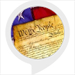

# &nbsp; [United States Presidents](http://alexa.amazon.com/#skills/amzn1.ask.skill.f3fb8eb1-7547-40ea-aa68-7976fd0a5eef)
 0

To use the United States Presidents skill, try saying...

* *Alexa, open american presidents and tell me a fact*

* *Alexa, open american presidents and give me a fact*

* *Alexa, tell american presidents to tell me something*

This skill tells the user about who was president of the United States of America.

***

### Skill Details

* **Invocation Name:** american presidents
* **Category:** null
* **ID:** amzn1.ask.skill.f3fb8eb1-7547-40ea-aa68-7976fd0a5eef
* **ASIN:** B01IRHJ9BS
* **Author:** Greg Szczygiel
* **Release Date:** July 22, 2016 @ 04:57:28
* **In-App Purchasing:** No
