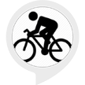

# &nbsp; [Bike Safety Tips](http://alexa.amazon.com/#skills/amzn1.ask.skill.34035d63-fc33-4ed3-830e-a21035a6a1fe)
 0

To use the Bike Safety Tips skill, try saying...

* *Alexa, ask bike safety for a fact.*

* *Alexa, ask bike safety to give me a fact.*

* *Alexa, ask bike safety to get a fact for me.*

Bike Safety Tips are common recommendations to follow if you are riding your bike on the road.

***

### Skill Details

* **Invocation Name:** bike safety
* **Category:** null
* **ID:** amzn1.ask.skill.34035d63-fc33-4ed3-830e-a21035a6a1fe
* **ASIN:** B01IS0HMOA
* **Author:** Madison Russo
* **Release Date:** July 22, 2016 @ 02:27:43
* **In-App Purchasing:** No
