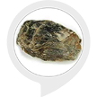

# &nbsp; [Mica Fact](http://alexa.amazon.com/#skills/amzn1.ask.skill.83d47a03-a703-419f-8282-87457947c832)
 0

To use the Mica Fact skill, try saying...

* *Alexa, ask mica fact to give me a mica fact*

* *Alexa, ask mica fact to tell me a fact*

* *Alexa, ask mica fact to tell me a mica fact*

These are few interesting facts about mineral mica

***

### Skill Details

* **Invocation Name:** mica fact
* **Category:** null
* **ID:** amzn1.ask.skill.83d47a03-a703-419f-8282-87457947c832
* **ASIN:** B01ISM3J8Q
* **Author:** Tanu 
* **Release Date:** July 22, 2016 @ 07:56:58
* **In-App Purchasing:** No
