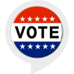

# &nbsp; [American Presidential Election Trivia Quiz](http://alexa.amazon.com/#skills/amzn1.ask.skill.0b78b0fc-a7ff-4d67-8a64-e090a6dec677)
 1

To use the American Presidential Election Trivia Quiz skill, try saying...

* *Alexa, Open election trivia*

* *Start new game*

* *My answer is one*

Use this game to test your knowledge on topics relating to election day. All the questions are based around American election day, it's a trivia game so you might not know everything, but as you continue to play you will learn more, and you don't get all the questions every game so there is always something new to look forwards to. Once you open it, it will list instructions on how to play the game, you can ask it for help if confused and if you don't hear a question you can ask it to repeat, if you take too long to answer it will repeat itself.

***

### Skill Details

* **Invocation Name:** election trivia
* **Category:** null
* **ID:** amzn1.ask.skill.0b78b0fc-a7ff-4d67-8a64-e090a6dec677
* **ASIN:** B01IUJZLC4
* **Author:** Antic2
* **Release Date:** July 26, 2016 @ 04:26:24
* **In-App Purchasing:** No
