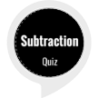

# &nbsp; [subtraction quiz](http://alexa.amazon.com/#skills/amzn1.ask.skill.79d311ba-efa9-4179-b94d-2d810e67a8c5)
 0

To use the subtraction quiz skill, try saying...

* *Alexa, open subtraction quiz*

* *repeat*

* *help*

A math subtraction quiz to learn basic skills.

***

### Skill Details

* **Invocation Name:** subtraction quiz
* **Category:** null
* **ID:** amzn1.ask.skill.79d311ba-efa9-4179-b94d-2d810e67a8c5
* **ASIN:** B01IUUDBDO
* **Author:** LJohnson
* **Release Date:** July 27, 2016 @ 09:26:46
* **In-App Purchasing:** No
