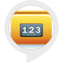

# &nbsp; [Number Facts](http://alexa.amazon.com/#skills/amzn1.ask.skill.10006046-ed4e-455d-a9ae-23023b39f2bb)
 0

To use the Number Facts skill, try saying...

* *Alexa, ask number facts*

* *Alexa, ask number facts about ten*

* *Alexa, ask number facts for ten*

Every Number has some facts or information associated to it. Number Facts, tells you the facts. its a fun game that adds lots of meaning and info to numbers.

***

### Skill Details

* **Invocation Name:** number facts
* **Category:** null
* **ID:** amzn1.ask.skill.10006046-ed4e-455d-a9ae-23023b39f2bb
* **ASIN:** B01IVAMZ58
* **Author:** Afrilogic
* **Release Date:** August 2, 2016 @ 03:26:45
* **In-App Purchasing:** No
