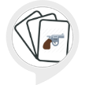

# &nbsp; [handgun flash cards](http://alexa.amazon.com/#skills/amzn1.ask.skill.17543e1f-c88a-4ade-9ff5-a6cc37fb629f)
 1

To use the handgun flash cards skill, try saying...

* *Alexa, start handgun flash cards.*

* *My answer is trigger*

* *start new game*

This flash card themed skill will introduce the user to the basic parts of a as well as a few interesting facts about handguns.  Simply enable this skill and then say "Alexa, start handgun flash cards".
Alexa will ask you questions and you can respond with "My answer is trigger", or simply "trigger".
Alexa will keep track of your score for you.
You can begin a new game by saying "start new game".
To exit a game simply say "end".
Knowledge is power, so give it a try and enjoy!

***

### Skill Details

* **Invocation Name:** handgun flash cards
* **Category:** null
* **ID:** amzn1.ask.skill.17543e1f-c88a-4ade-9ff5-a6cc37fb629f
* **ASIN:** B01IWS6956
* **Author:** Belgarion Apps
* **Release Date:** July 25, 2016 @ 06:26:26
* **In-App Purchasing:** No
