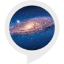

# &nbsp; [Space Guy](http://alexa.amazon.com/#skills/amzn1.ask.skill.49c391d0-60cd-40b4-bbb3-711c703e8d8e)
 1

To use the Space Guy skill, try saying...

* *Alexa, ask space guy for  sun*

* *alexa, ask space guy what  is  oort cloud*

* *alexa, ask space guy about  jupiter*

We can  find  information  about  solar  system  in books  and  in web , but  its a  great  way  to  teach kids or  improve  knowledge  through a  voice  based teaching  system.
The  skill  will give  details  of  solar  system for  limited set  of  topics.
These  topics  will be increased to  a  vast  range  in  upcoming  releases
Current Topics : Solar System, Sun, Mercury, Venus, Earth, Mars, Asteroid belt, Ceres, Jupiter, Saturn, Uranus, Neptune, Centaurs, Comet, Kuiper belt, Pluto, Oort cloud

***

### Skill Details

* **Invocation Name:** space guy
* **Category:** null
* **ID:** amzn1.ask.skill.49c391d0-60cd-40b4-bbb3-711c703e8d8e
* **ASIN:** B01IYYLU3Y
* **Author:** DCOM
* **Release Date:** July 29, 2016 @ 03:26:40
* **In-App Purchasing:** No
