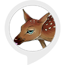

# &nbsp; [Swiggity Swooty](http://alexa.amazon.com/#skills/amzn1.ask.skill.1df2afae-1c2a-4055-a029-e65f3f276be4)
 4

To use the Swiggity Swooty skill, try saying...

* *Alexa, ask your boy about swiggity swooty coming for that booty*

* *Alexa, tell your boy about swiggity swooty*

* *Alexa, ask your boy about that booty*

Do you ever want to listen to swiggity swooty? Well, this skill plays 90 seconds of the clip on your Echo! Just ask Alexa and she'll obey!

***

### Skill Details

* **Invocation Name:** your boy
* **Category:** null
* **ID:** amzn1.ask.skill.1df2afae-1c2a-4055-a029-e65f3f276be4
* **ASIN:** B01IZ13GOW
* **Author:** MahiSoftware
* **Release Date:** August 2, 2016 @ 07:36:48
* **In-App Purchasing:** No
