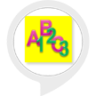

# &nbsp; [Alphabet Calculator](http://alexa.amazon.com/#skills/amzn1.ask.skill.f1d5d968-1363-4a28-92e9-828110da72c9)
 1

To use the Alphabet Calculator skill, try saying...

* *Alexa, ask alphabet calculator*

* *Alexa, start alphabet calculator*

* *help*

Alphabet Calculator is a simple fun game for kids and for adults as well. One can learn addition of 3 number equivalent of alphabets .
Alexa will ask you to add the three letter word. Alexa will provide a 3 letter word you will need to add the number equivalent of the 3 alphabets. For example, If the word is ANT: A N T, you would add 1 for A, 14 for N, 20 for T and say 35 as the answer. 
This fun Alexa powered app randomly asks for 5 three letter words. On right answer, you score a point. For wrong answer, Alexa kindly tells you the right answer so that you can score 5 out of 5 in the next round. 
Warning for parents: please learn these skills first by Googling nops that is old way of doing things… Echoing - “Alexa, start  alphabet calculator”  if you do not want be embarrassed.

***

### Skill Details

* **Invocation Name:** alphabet calculator
* **Category:** null
* **ID:** amzn1.ask.skill.f1d5d968-1363-4a28-92e9-828110da72c9
* **ASIN:** B01IZ1NGOC
* **Author:** Saraj Mudigonda
* **Release Date:** July 26, 2016 @ 03:26:39
* **In-App Purchasing:** No
