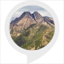

# &nbsp; [olympus mountain helper](http://alexa.amazon.com/#skills/amzn1.ask.skill.d77479c2-b40e-45f3-8c3e-1433276a6ea8)
 0

To use the olympus mountain helper skill, try saying...

* *Alexa, ask olympus mountain what is the elevation?*

* *What are it's neighbors?*

* *What is the High School name?*

Mount Olympus Helper will assist you in learning about the Olympus Mountain in Salt Lake City, Utah.

***

### Skill Details

* **Invocation Name:** olympus mountain
* **Category:** null
* **ID:** amzn1.ask.skill.d77479c2-b40e-45f3-8c3e-1433276a6ea8
* **ASIN:** B01IZ5NERC
* **Author:** Bobcat
* **Release Date:** August 17, 2016 @ 04:52:49
* **In-App Purchasing:** No
