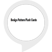

# &nbsp; [Design Pattern Flash Cards](http://alexa.amazon.com/#skills/amzn1.ask.skill.4fade8c7-17e7-470b-a6b9-29c1af26d73f)
 0

To use the Design Pattern Flash Cards skill, try saying...

* *Alexa, open design pattern flash cards*

* *Repeat*

* *Help*

Studying for an exam?  Need a refresher on the most popular Design Patterns?  Look no further.  This application will randomly select a design pattern description and say it to you.  Simply respond with the correct design pattern name.  How many can you get correct?

Begin by enabling the skill and saying "Alexa, open design pattern flash cards."

***

### Skill Details

* **Invocation Name:** design pattern flash cards
* **Category:** null
* **ID:** amzn1.ask.skill.4fade8c7-17e7-470b-a6b9-29c1af26d73f
* **ASIN:** B01J00MX5A
* **Author:** mastash3ff
* **Release Date:** August 4, 2016 @ 06:11:46
* **In-App Purchasing:** No
