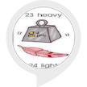

# &nbsp; [opposite words](http://alexa.amazon.com/#skills/amzn1.ask.skill.a584d06b-65e6-44e6-b240-e7e02b2ce1f2)
 1

To use the opposite words skill, try saying...

* *Alexa, launch opposite words*

* *Alexa, open opposite words*

* *help*

Learn opposite words.

***

### Skill Details

* **Invocation Name:** opposite words
* **Category:** null
* **ID:** amzn1.ask.skill.a584d06b-65e6-44e6-b240-e7e02b2ce1f2
* **ASIN:** B01J0E7FWW
* **Author:** Ashish Singh
* **Release Date:** August 4, 2016 @ 05:41:34
* **In-App Purchasing:** No
