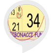

# &nbsp; [Fibonacci Sequence](http://alexa.amazon.com/#skills/amzn1.ask.skill.c239e948-965a-4496-be4c-25a90221b8c2)
 0

To use the Fibonacci Sequence skill, try saying...

* *Alexa, ask fibonacci fun*

* *repeat*

* *help*

Fibonacci fun is a simple fun game for kids. Kids can learn fibonacci sequence and also simple addition subtraction of 1, 2 and 3 digit numbers.
 
Alexa will provide a fibonacci sequence and ask you for the next number or the previous number in sequence. For example, for the next number in this Fibonacci Sequence 1, 2, 3, you would add 2 and 3 and say 5 and for the previous number in the sequence 5,8 you would subtract 5 from 8 and say 3. To start a new game at any time, say, start new game.  To repeat the last word, say, repeat. You can always say help to get help from Alexa. This skill is based on standard Fibonacci Sequence -  0, 1, 1, 2, 3, 5, 8, 13, 21, 34, 55, 89, 144, 233, 377, 610, 987...

***

### Skill Details

* **Invocation Name:** fibonacci fun
* **Category:** null
* **ID:** amzn1.ask.skill.c239e948-965a-4496-be4c-25a90221b8c2
* **ASIN:** B01J0EGBXG
* **Author:** Saraj Mudigonda
* **Release Date:** August 2, 2016 @ 01:26:41
* **In-App Purchasing:** No
