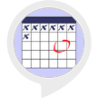

# &nbsp; [Date Counter](http://alexa.amazon.com/#skills/amzn1.ask.skill.8eceba64-c029-4c26-9674-a41dcea09778)
 1

To use the Date Counter skill, try saying...

* *Alexa, ask Date Counter how many weeks until December 25th*

* *Alexa, ask Date Counter how many days until December 25th 2018*

* *Alexa, ask Date Counter how long till December 25th*

D-day Counter simply can tell you how many weeks and days left until the date you say. Now it is simple and easy to know how long until the important date.

***

### Skill Details

* **Invocation Name:** date counter
* **Category:** null
* **ID:** amzn1.ask.skill.8eceba64-c029-4c26-9674-a41dcea09778
* **ASIN:** B01J1056R6
* **Author:** TheCodeBooth
* **Release Date:** July 29, 2016 @ 09:26:33
* **In-App Purchasing:** No
