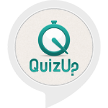

# &nbsp; [world largest smallest](http://alexa.amazon.com/#skills/amzn1.ask.skill.d48fc4cf-e8e2-4bab-a999-d951f34dafa5)
 0

To use the world largest smallest skill, try saying...

* *Alexa, launch world largest smallest*

* *the answer is one*

* *stop*

This is a simple quiz game. Alexa will ask 10 questions and you have answer each question by number of correct answer. If you give wrong answer then Alexa will teach you correct answer. After answering all questions you will get the total score.

***

### Skill Details

* **Invocation Name:** world largest smallest
* **Category:** null
* **ID:** amzn1.ask.skill.d48fc4cf-e8e2-4bab-a999-d951f34dafa5
* **ASIN:** B01J1W2WFS
* **Author:** Md. Khairul Alam
* **Release Date:** July 29, 2016 @ 05:26:50
* **In-App Purchasing:** No
