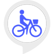

# &nbsp; [Bike Finder](http://alexa.amazon.com/#skills/amzn1.echo-sdk-ams.app.e6d63a06-1a4a-4a7e-b05c-715c169967a9)
 0

To use the Bike Finder skill, try saying...

* *Alexa, ask Bike Finder how many bikes are available*

* *Alexa, ask Bike Finder if there are any bikes available*

* *Alexa, ask Bike Finder how many bikes are available at my station*

Bike Finder helps you determine whether there are bikes available at your favorite bike share station before you leave your house!
  
Before using Bike Finder, you will need to link your account - just enter your address in a supported city and select your favorite nearby bike station.
  
Bike Finder works with 25 different bike shares:
  
ArborBike - Ann Arbor, MI
 
Austin B-Cycle - Austin, TX
 
Boulder B-Cycle - Boulder, CO
 
Broward B-Cycle - Fort Lauderdale, FL
 
Bublr Bikes - Milwaukee, WI
 
Capital Bike Share - Washington, DC
 
Charlotte B-Cycle - Charlotte, NC
 
Cincy Red Bike - Cincinnati, OH
 
Citi Bike - New York City, NY
 
Denver B-Cycle - Denver, CO
 
El Paso B-Cycle - El Paso, TX
 
Fort Worth Bike Sharing - Fort Worth, TX
 
Great Rides Bike Share - Fargo, ND
 
GREENbike - Salt Lake City, UT
 
Heartland B-Cycle - Omaha, NE
 
Houston B-Cycle - Houston, TX
 
Hubway - Boston, MA
 
Indego - Philadelphia, PA
 
Indy - Pacers Bikeshare - Indianapolis, IN
 
Kansas City B-Cycle - Kansas City, MO
 
Link Dayton Bike Share - Dayton, OH
 
Madison B-Cycle - Madison, WI
 
Pronto - Seattle, WA
 
San Antonio B-Cycle - San Antonio, TX
 
Spartanburg BCycle - Spartanburg, SC
  
If you have any feedback, please contact us at alexabikefinder@gmail.com!

***

### Skill Details

* **Invocation Name:** bike finder
* **Category:** null
* **ID:** amzn1.echo-sdk-ams.app.e6d63a06-1a4a-4a7e-b05c-715c169967a9
* **ASIN:** B01J309ZB2
* **Author:** rsbaskin
* **Release Date:** August 17, 2016 @ 01:52:51
* **Privacy Policy:** https://www.rsbaskin.com/bikefinder/privacy.html
* **In-App Purchasing:** No
