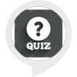

# &nbsp; [U S Capital Quiz](http://alexa.amazon.com/#skills/amzn1.ask.skill.e27d4687-f72d-474c-9e46-bf73c2126425)
 0

To use the U S Capital Quiz skill, try saying...

* *Alexa, Ask american capitals start a new game*

* *help*

* *repeat*

Quiz on state capitals of USA

***

### Skill Details

* **Invocation Name:** american capitals
* **Category:** null
* **ID:** amzn1.ask.skill.e27d4687-f72d-474c-9e46-bf73c2126425
* **ASIN:** B01J6JUX3O
* **Author:** invotive
* **Release Date:** August 2, 2016 @ 07:36:25
* **In-App Purchasing:** No
