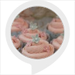

# &nbsp; [How to Make A Cupcake](http://alexa.amazon.com/#skills/amzn1.ask.skill.acc886b7-3019-4581-88cb-a3fa3bf55edc)
 0

To use the How to Make A Cupcake skill, try saying...

* *Alexa ask cup cake how to make a cupcake*

* *Find me a cupcake recipe*

* *Alexa launch cup cake*

In this app you will learn how to bake a batch of your very own cupcakes. If you are allergic to flour, milk, or eggs please don't use this recipe.

***

### Skill Details

* **Invocation Name:** cup cake
* **Category:** null
* **ID:** amzn1.ask.skill.acc886b7-3019-4581-88cb-a3fa3bf55edc
* **ASIN:** B01J9MBRLU
* **Author:** Personal
* **Release Date:** August 10, 2016 @ 02:37:35
* **In-App Purchasing:** No
