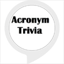

# &nbsp; [acronym trivia](http://alexa.amazon.com/#skills/amzn1.ask.skill.022f576f-8db1-43d5-a90d-f3f1abd4d2f0)
 0

To use the acronym trivia skill, try saying...

* *Alexa, start acronym trivia*

* *my answer is one*

* *Alexa, ask acronym trivia to start new game*

Alexa will ask the player with an acronym and four multiple choice answers.  The player will need to supply the correct answer by supplying the correct number.

***

### Skill Details

* **Invocation Name:** acronym trivia
* **Category:** null
* **ID:** amzn1.ask.skill.022f576f-8db1-43d5-a90d-f3f1abd4d2f0
* **ASIN:** B01JCLMCUS
* **Author:** Brian Hager
* **Release Date:** August 1, 2016 @ 06:56:35
* **In-App Purchasing:** No
