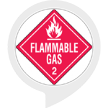

# &nbsp; [Hazmat](http://alexa.amazon.com/#skills/amzn1.ask.skill.263ddb23-fa47-4c8b-894d-f7c17353e48a)
 0

To use the Hazmat skill, try saying...

* *Alexa, Ask haz mat about one zero seven two*

* *Alexa, Ask haz mat twelve twenty three*

* *Alexa, Ask haz mat two five eight eight*

Ask hazmat will satisfy your curiosity when you or your children see a commercial truck or tanker while driving.   You simply tell Alexa the 4-digit number that's on the diamond placard and Alexa will tell you what's on the truck.  Is it milk, gasoline, oxygen, or something bad you really don't want to follow on the road ?  This is a great program for new cars that have Alexa built in, or if you've paired up an Echo Dot to your car bluetooth.   The results come from a database copied from Wikipedia.  Please only use this program for entertainment, not for emergency services.

***

### Skill Details

* **Invocation Name:** has mat
* **Category:** null
* **ID:** amzn1.ask.skill.263ddb23-fa47-4c8b-894d-f7c17353e48a
* **ASIN:** B01JCZI00A
* **Author:** Espark
* **Release Date:** August 5, 2016 @ 05:07:30
* **In-App Purchasing:** No
