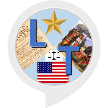

# &nbsp; [Liberty Trivia](http://alexa.amazon.com/#skills/amzn1.ask.skill.e4ff5e75-84c4-42dc-9a5b-0ce84b54e204)
 0

To use the Liberty Trivia skill, try saying...

* *Alexa Open Liberty Trivia*

* *Alexa Start Liberty Trivia*

* *Alexa Begin Liberty Trivia*

This is a simple trivia game which asks the player questions along a Liberty and Freedom theme.  Most of the questions center on the  American experience.  In time the question pool shall grow to include liberty oriented questions based on human experiences from across the globe and time.

***

### Skill Details

* **Invocation Name:** liberty trivia
* **Category:** null
* **ID:** amzn1.ask.skill.e4ff5e75-84c4-42dc-9a5b-0ce84b54e204
* **ASIN:** B01JDJ3YZG
* **Author:** Shipley Ideas
* **Release Date:** August 1, 2016 @ 05:56:29
* **In-App Purchasing:** No
