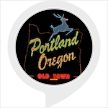

# &nbsp; [portland facts](http://alexa.amazon.com/#skills/amzn1.ask.skill.b7e4f43c-2e66-46fa-b6a8-a587e211a8a6)
 0

To use the portland facts skill, try saying...

* *Alexa, portland fact*

* *Alexa, tell portland fact to tell me a portland fact*

* *Alexa, ask portland fact to give me some portland information*

This skill tells random facts about Portland, Oregon

***

### Skill Details

* **Invocation Name:** portland fact
* **Category:** null
* **ID:** amzn1.ask.skill.b7e4f43c-2e66-46fa-b6a8-a587e211a8a6
* **ASIN:** B01JDJE1XU
* **Author:** NWOps
* **Release Date:** August 3, 2016 @ 01:41:38
* **In-App Purchasing:** No
