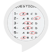

# &nbsp; [General Knowledge Trivia Game](http://alexa.amazon.com/#skills/amzn1.ask.skill.769d4a36-8715-4e32-9428-0e51a0cee89c)
 2

To use the General Knowledge Trivia Game skill, try saying...

* *Alexa, open Trivia Game*

* *Repeat*

* *Help*

Test your knowledge!

This skill is fun and challenging for everyone!

***

### Skill Details

* **Invocation Name:** trivia game
* **Category:** null
* **ID:** amzn1.ask.skill.769d4a36-8715-4e32-9428-0e51a0cee89c
* **ASIN:** B01JDLSRGK
* **Author:** Chris Smolen
* **Release Date:** August 8, 2016 @ 02:37:51
* **In-App Purchasing:** No
