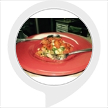

# &nbsp; [Portland restaurant tips](http://alexa.amazon.com/#skills/amzn1.ask.skill.9a89b81c-7e39-414a-b6b5-5116153a4b86)
 1

To use the Portland restaurant tips skill, try saying...

* *Alexa, Ask Food Mania where should I eat*

* *Alexa, Ask Food Mania for a restaurant*

* *Alexa, Ask Food Mania to tell me a good eat-out in Portland*

Save time thinking of which Restaurants to try in Portland and ask Alexa instead. Suggests the top rated restaurants in Portland for all the food-lovers out there.

***

### Skill Details

* **Invocation Name:** food mania
* **Category:** null
* **ID:** amzn1.ask.skill.9a89b81c-7e39-414a-b6b5-5116153a4b86
* **ASIN:** B01JDOEWQ6
* **Author:** Ritika Borkar
* **Release Date:** August 5, 2016 @ 04:37:32
* **In-App Purchasing:** No
