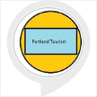

# &nbsp; [Portland Tourism](http://alexa.amazon.com/#skills/amzn1.ask.skill.e338c5fd-ba96-4037-90c3-438cc22d6b14)
 0

To use the Portland Tourism skill, try saying...

* *Alexa ask Portland tourism where should I go*

* *Alexa ask Portland tourism to take me somewhere*

* *Alexa ask Portland tourism to tell me a good place in Portland*

Ask Alexa where you should I go to visit in Portland. Suggests the best tourist spots in Portland.

***

### Skill Details

* **Invocation Name:** portland tourism
* **Category:** null
* **ID:** amzn1.ask.skill.e338c5fd-ba96-4037-90c3-438cc22d6b14
* **ASIN:** B01JDR29MC
* **Author:** Samkit Jain
* **Release Date:** August 8, 2016 @ 02:37:34
* **In-App Purchasing:** No
